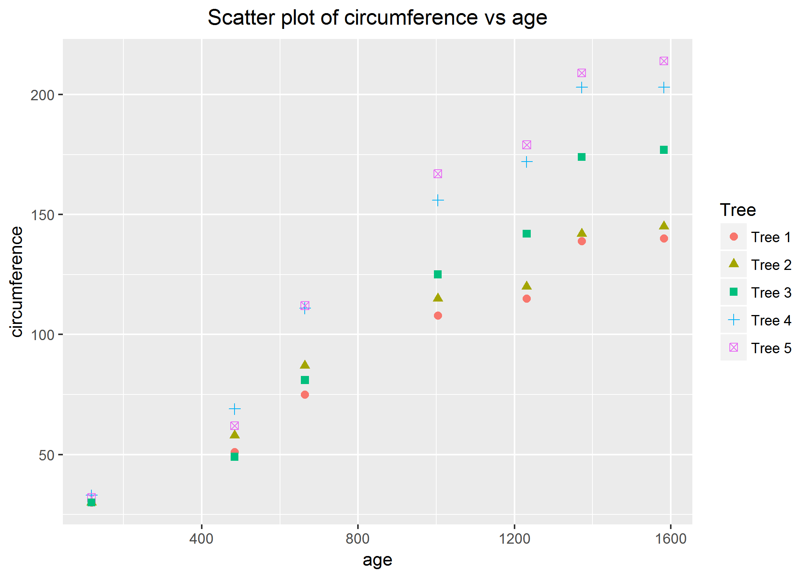
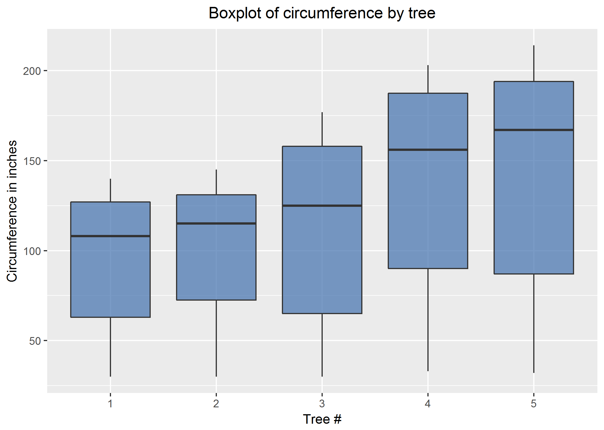

<b>Introduction</b>
<br>
<p>
The built in data set Orange in R describe the growth of orange trees.  The trunk circumference of 5 trees  is  measured  at 7  different  ages,  giving  a  total  of  35  datapoints. There are three columns in the dataset namely
 1. Tree - Indicates the specific tree of the 5 trees on which the measurement is taken.
 2. age - Age of the tree in days (days since 1968/12/31)
 3. circumference - trunk circumference in mm.
As the age of the tree increases, the trunk circumference which will be increasing a lot initially, would become constant (very less increase in the circumferece) which will mean that the tree is fully grown.
In this study, we will examine this behaviour of the tree.

</p>
<br>
<br>

```{r}
# Load dplyr and ggplot2 packages
library(doBy)
library(ggplot2)
# Print out Orange data which is built-in.
Orange
```

<b>Question 1: Calculate the mean and the median of the trunk circumferences for different size of the trees. (Tree)?</b>
```{r}
# This prints out mean and median which are listed in FUN. This compares circumference by tree.
summaryBy(circumference  ~ Tree, data=Orange , FUN=c(mean,median),na.rm=TRUE,keep.names=TRUE)
```
Based on the above result, it can be said that the circumference of different trees are different as it depends on various factors like soil, climate, water, air quality etc. This is an expected behaviour.
<br>
<br>

<b>Question 2: Make a scatter plot of the trunk circumferences against the age of the tree. Use different plotting symbols for different size of trees.</b>
```{r}
# This code is to explicitly specify the order in which the graph should be displayed.
Orange$Tree <- factor(Orange$Tree, labels = c("1", "2", "3", "4", "5"))
# Plotting sizes versus different trees.
plot1 <- ggplot(Orange, aes(x = age, y = circumference, shape = Tree, color = Tree)) + geom_point(size = 2) +
  ggtitle("Scatter plot of circumference vs age") + theme(plot.title = element_text(hjust = 0.5)) +
  scale_color_discrete(name ="Tree", labels=c("Tree 1","Tree 2","Tree 3","Tree 4","Tree 5")) + 
  scale_shape_discrete(name ="Tree", labels=c("Tree 1","Tree 2","Tree 3","Tree 4","Tree 5")) 

# Save the plot
ggsave(filename = "graphs/Scatter plot of circumference vs age.png", device="png", plot=plot1)
# Display the plot in the markdown file
```

<br>
Looking at the graph, it can be said that for all the trees, the circumference was increasing during the initial days but after around 1400 days, the rate of increase in circumference dropped significantly to almost zero suggesting the Orange tree is fully grown by around 1400 days of age.  
<br>
<br>
<b>Question 3: Display the trunk circumferences on a comparative boxplot against tree. Be sure you order the boxplots in the increasing order of maximum diameter.</b>
```{r}
plot2 <- ggplot(Orange, aes(x = Tree, y = circumference)) + geom_boxplot(fill = "#4271AE", alpha = .7) + 
   scale_x_discrete(name = "Tree #") + scale_y_continuous(name = "Circumference in inches") +
   ggtitle("Boxplot of circumference by tree") + theme(plot.title = element_text(hjust = 0.5))
# Save the plot
ggsave(filename = "graphs/Boxplot of circumference by tree.png", device="png", plot=plot2)
# Display the plot in the markdown file
```

<br>
Boxplot analysis shows that since the median of the circumference is not in the center but is closed towards the top with lower hinge of larger length then the upper hinge suggesting that the circumference on the orange tree increases which a large rate during the initial days but with time, the growth rate of the tree decreases.
<br>
<br>
<b>Conclusion</b>
<br>
<p>
In this study, we have tried to examine the relationship between the trunk circumference of the Orange tree with its age. The study incorporates visual tools to examine this relationship.

The conclusion drawn from the visual inspection of the data is as below: -
During the initial days of the tree, the groth rate is high but as the days pass, the growth rate of the tree decreases and reach to almost zero by the time its fully grown. All the 5 Orange trees shows the similar behaviour. Aroung tree age of 1400 days, the growth rate reaches the almost zero point. So it can be said that the Orange tree is fully grown within a period of around 1400 days.
</p>
