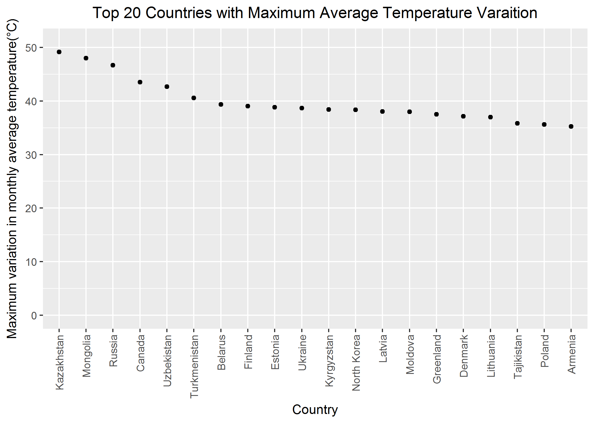
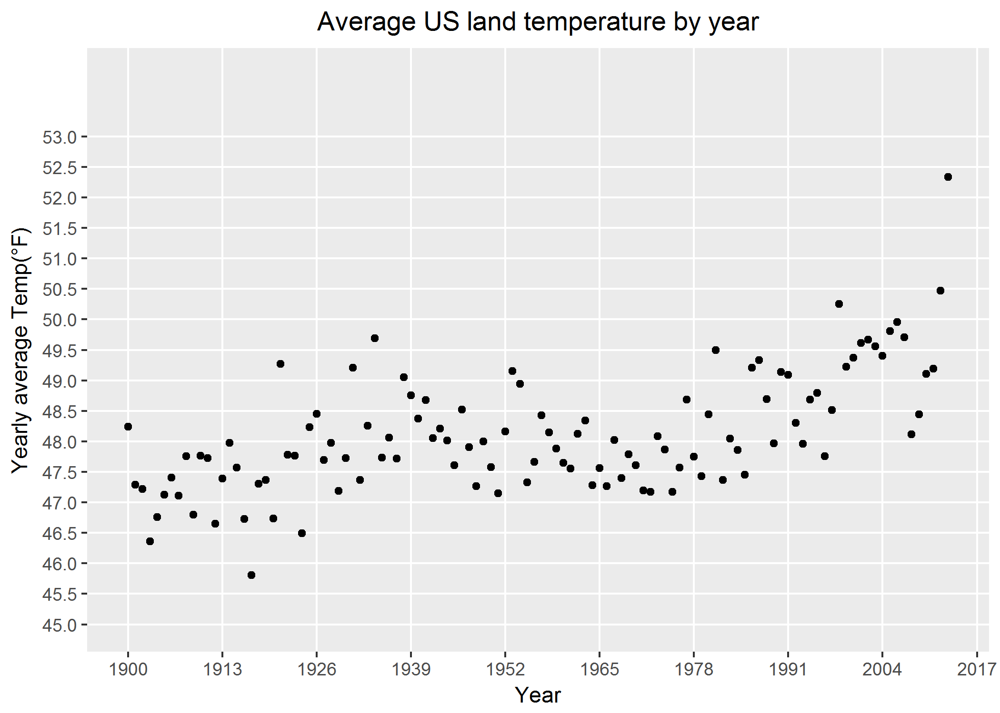

<b>Introduction</b>
<br>
<p>
THe average monthly temperature variation of a country 
There are 2 datasets namely Temp.csv and CityTemp.csv, first one having average monthly temperature of the various countries around the world and the second contains the average monthly treperatures of various cities around the world. 

</p>
<br>
<br>

```{r}
# Load dplyr and ggplot2 packages
library(dplyr)
library(ggplot2)
# Import the tidied/cleaned temp and citytemp data into R data frame

# Load the cleaned temperature data into a data frame named cleaned_temp 
# Source data file: data/cleaned_Temp_Data.txt
cleaned_temp <- read.csv("data/cleaned_Temp_Data.txt",header=T, sep="\t")

# Load the cleaned city temperature data into a data frame named cleaned_city_temp
# Source data file: data/cleaned_City_Temp_Data.txt
cleaned_city_temp <- read.csv("data/cleaned_City_Temp_Data.txt",header=T, sep="\t")

# Print the first 6 records of the cleaned files to verify that the data loaded correctly
head(cleaned_temp)
head(cleaned_city_temp)

```

<b>Question 1: Find the difference between the maximum and the minimum monthly average temperatures for each country and report/visualize top 20 countries with the maximum differences for the period since 1900.</b>
```{r}
# To determine difference between the maximum and the minimum monthly average temperatures for each country
#  since 1900, select the records with date starting - '1900-01-01' and group the selected data by country
group_temp_by_country <- group_by(cleaned_temp[as.Date(cleaned_temp$Date)>=as.Date('1900-01-01'),], Country)
# Calculate the difference between the maximum and the minimum monthly average temperatures for each country
temp_diff <- as.data.frame(summarise(group_temp_by_country, max(Monthly.AverageTemp) - min(Monthly.AverageTemp)))
# Set proper column headings
temp_diff <- setNames(temp_diff, c("Country","Maximum.variation.in.monthly.avg.temp.since.1900"))
# Rearrange the data frame in descending order of the difference in temperatures
temp_diff <- arrange(temp_diff,desc(Maximum.variation.in.monthly.avg.temp.since.1900))
# Write this data having maximum monthly average temperature variation by country into the data folder with file 
#  name as max_monthly_temp_varaition_by_country.txt
write.table(temp_diff, 'data/max_variation_in_monthly_avg_temp_by_country.txt', sep = "\t", row.names = FALSE, quote = FALSE)
# Retrieve top 20 countries with the maximum differences for the period since 1900
top_20_temp_diff <- head(temp_diff,n=20) 
# View the top 20 countries by temp difference
top_20_temp_diff
# To avoid the automatic alphabetic ordering of the data while plotting the Country, explicitly specify the order of the data and then plot the graph.
top_20_temp_diff$Country <- factor(top_20_temp_diff$Country,levels=top_20_temp_diff$Country[order(desc(top_20_temp_diff$Maximum.variation.in.monthly.avg.temp.since.1900))])
q <- qplot(x=top_20_temp_diff$Country, y=top_20_temp_diff$Maximum.variation.in.monthly.avg.temp.since.1900,
           xlab="Country", ylab="Maximum variation in monthly average temperature(°C)", 
           main="Top 20 Countries with Maximum Average Temperature Varaition", ylim = c(0,51)) + theme(axis.text.x = element_text(angle = 90, hjust=1, vjust=0.5), plot.title = element_text(hjust = 0.5))
# Save the plot
ggsave(filename = "graphs/Maximum Temp Variation.png", device="png", plot=q)
# Display the plot in the markdown file
```

Based on the above result, it can be said that top 20 courtries based on the Maximum variation in monthly average temperature are having the variation in the range of 35 to 50.
<br>
<br>
<b>Question 2: Select a subset of data called “UStemp” where US land temperatures from 01/01/1990 in Temp data. Use UStemp dataset to answer the followings.(2.a, 2.b and 2.c)</b>
```{r}
# Creation of "UStemp” - US land temperatures data from 01/01/1990
UStemp <- cleaned_temp[as.Date(cleaned_temp$Date)>=as.Date('1900-01-01') & cleaned_temp$Country == 'United States',]
# View the first few records of UStemp dataset
head(UStemp)
# since the row numbers are not re-initialized automatically, so re-initialize the row numbers
rownames(UStemp) <- NULL
# View the first few records of UStemp dataset again
head(UStemp)
```
<br>
<b>Question 2.a: Create a new column to display the monthly average land temperatures in Fahrenheit (°F).</b>
```{r}
# New column having monthly average US land temperatures in Fahrenheit
UStemp$Monthly.AverageTemp.F <- UStemp$Monthly.AverageTemp * 1.8 + 32
```
<b>Question 2.b: Calculate average land temperature by year and plot it. The original file has the average land temperature by month.</b>
```{r}
# Calculation of average land temperature by year
# Group the US land temperature data by year and then calculate the average temp for the year
UStemp_year <- group_by(UStemp, as.numeric(format(as.Date(UStemp$Date), '%Y'))) %>% summarize(mean(Monthly.AverageTemp.F))
# Set proper column headings
UStemp_year <- setNames(UStemp_year, c("Year","Yearly.avg.temp.F"))
q <- qplot(x=UStemp_year$Year, y=UStemp_year$Yearly.avg.temp.F, xlab = "Year", ylab="Yearly average Temp(°F)", main="Average US land temperature by year") + scale_x_continuous(breaks = seq(1900,2017, 13),minor_breaks=NULL) + scale_y_continuous(breaks = seq(45,53,0.5),minor_breaks=NULL, limits=c(45,54)) + theme(plot.title = element_text(hjust = 0.5))
# Save the plot
ggsave(filename = "graphs/Average US land temperature by year.png", device="png", plot=q)
# Display the plot in the markdown file
```


<br>
Looking at the graph, it can be said that the average US land temperature does not follow any trend. Its randomly distributed and but the overall picture suggests that there is an increase in the average US land temperatures throughout these years. Also since the last few years, the average temperature is increasing continously indicating the climate change. Since 2008, the average US land temperature is increasing.
<br>
<br>
<b>Question 2.c: Calculate the one year difference of average land temperature by year and provide the maximum difference (value) with corresponding two years.</b>
```{r}
# Calculation of the one year difference of average land temperature by year
# For this, create a data frame having first column as the years whose temperature difference is taken (format of 'YYYY - YYYY') and the 
#  second column is the difference in temperatures
year_difference_of_temp <- (sapply(1:(length(UStemp_year$Year)-1),function(x){paste(as.character(UStemp_year$Year[x+1]), '-', as.character(UStemp_year$Year[x]))})) %>% as.data.frame %>% setNames(c("Years"))
year_difference_of_temp$temp_diff <- sapply(1:(length(UStemp_year$Yearly.avg.temp.F)-1), function(x){diff(UStemp_year$Yearly.avg.temp.F[x:(x+1)])})
# Write this data having yearly US average temperature variation by country into the data folder with file 
#  name as difference_of_average_US_land_temperature_by_year.txt
write.table(year_difference_of_temp, 'data/difference_of_average_US_land_temperature_by_year.txt', sep = "\t", row.names = FALSE, quote = FALSE)

# maximum difference (value)
index_of_max_value <- which(year_difference_of_temp$temp_diff == max(abs(year_difference_of_temp$temp_diff)))
paste('Maximum difference in average US land temperature for two consecutive years is ' , abs(year_difference_of_temp$temp_diff[index_of_max_value]), 
      '°F for year ' , year_difference_of_temp$Years[index_of_max_value], sep='')
```
<br>
Maximum difference in average US land temperature for two consecutive years is 2.5401°F for year 1921 - 1920
<br>
<br>
<b>Question 3: Download “CityTemp” data set at box.com. Find the difference between the maximum and the minimum temperatures for each major city and report/visualize top 20 cities with maximum differences for the period since 1900.</b>
```{r}
# CityTemp data already downloaded and is in the dataset namely cleaned_city_temp
# Find the top 20 cities with maximum difference in maximum and minimum temperatures for the period since 1900
city_temp_since_1900 <- cleaned_city_temp[as.Date(cleaned_city_temp$Date)>=as.Date('1900-01-01'),] 
# Merging City name with Country so as to view Country names as well with the city names.
city_temp_since_1900$City <- paste(city_temp_since_1900$City,' (', city_temp_since_1900$Country, ')' , sep='')
top_20_city_temp_diff_since_1900 <- summarize(group_by(city_temp_since_1900, City,Country),  max(Monthly.AverageTemp) - min(Monthly.AverageTemp)) %>%
  as.data.frame() %>% setNames(c("City","Country","max_and_min_Temp_difference_since_1900")) %>% arrange(desc(max_and_min_Temp_difference_since_1900)) %>% head(n=20)
# View the data of top 20 cities with maximum differences (difference between maximum and the minimum temperatures) for the period since 1900
top_20_city_temp_diff_since_1900
# To avoid the automatic alphabetic ordering of the data while plotting the City, explicitly specify the order of the data and then plot the graph.
top_20_city_temp_diff_since_1900$City <- factor(top_20_city_temp_diff_since_1900$City,levels=top_20_city_temp_diff_since_1900$City[order(desc(top_20_city_temp_diff_since_1900$max_and_min_Temp_difference_since_1900))])
q <- qplot(x=top_20_city_temp_diff_since_1900$City,y=top_20_city_temp_diff_since_1900$max_and_min_Temp_difference_since_1900, xlab="City (Country)", ylab="Difference in Maximum and Minimum Tempeatures since 1900 (°C)", main="Top 20 Cities with Maximum Average Temperature Variation", ylim = c(0,55)) + theme(axis.text.x = element_text(angle = 90,hjust=1, vjust=0.5),plot.title = element_text(hjust = 0.5))
# Save the plot
ggsave(filename = "graphs/Maximum Temp Variation-City.png", device="png", plot=q)
# Display the plot in the markdown file
```

<br>
Based on the above result, it can be said that top 20 cities based on the Maximum variation in monthly average temperature are having the variation in the range of around 33 to 47.
<br>
<br>
<b>Question 4: Compare the two graphs in (i) and (iii) and comment it.</b>

<br>
<br>
<b>Conclusion</b>
<br>
<p>
In this study, we have tried to examine the relationship between the trunk circumference of the Orange tree with its age. The study incorporates visual tools to examine this relationship.

The conclusion drawn from the visual inspection of the data is as below: -
During the initial days of the tree, the groth rate is high but as the days pass, the growth rate of the tree decreases and reach to almost zero by the time its fully grown. All the 5 Orange trees shows the similar behaviour. Aroung tree age of 1400 days, the growth rate reaches the almost zero point. So it can be said that the Orange tree is fully grown within a period of around 1400 days.
</p>
